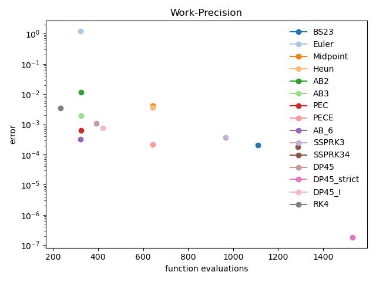
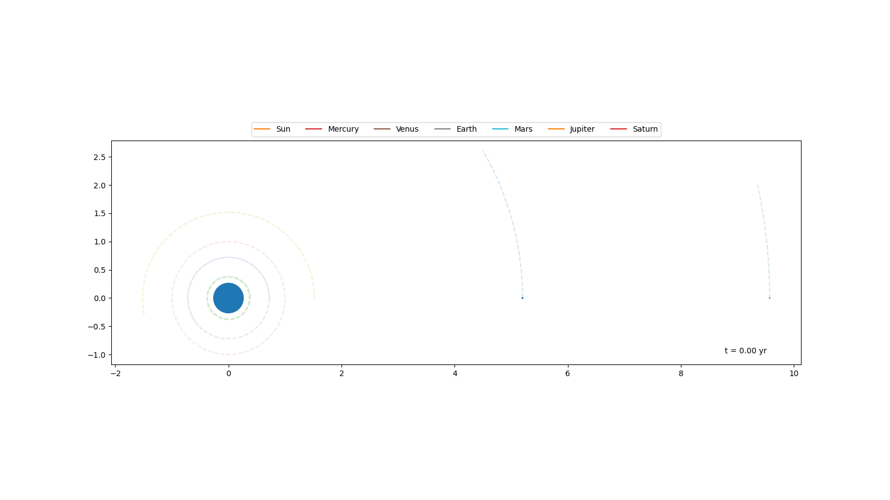

# ODE solvers
Python implementations of several ODE solvers. Includes Runge-Kutta and basic multistep methods, but the extrapolation methods are the main focus.
Some helper functions for root finding and Jacobian computation are also available.
All methods return function, Jacobian and LU computation/evaluation frequencies so that their relative performance can be compared.

# Examples
## work-precision graphs

## N-body simulation
