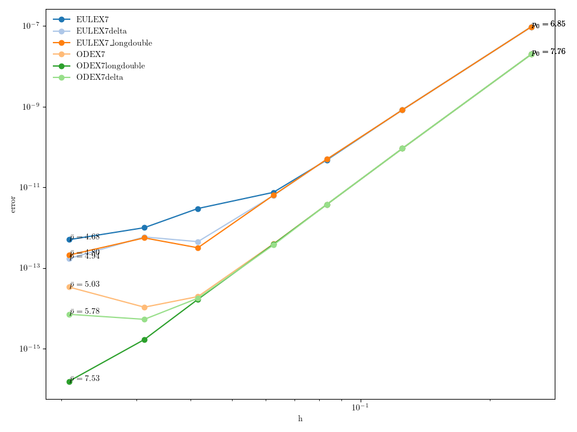
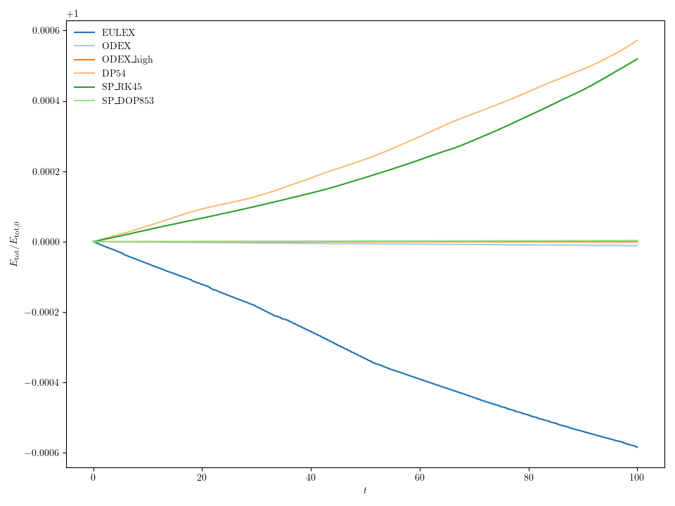

# ODE solvers
This project provides a very extensible implementation of extrapolation schemes for time integration.

Explicit and implicit methods with variants for implicit ODEs, many different step sequences, rational and polynomial extrapolation, different step controllers are all available.
Two very advanced step controllers for selecting pairs of step size and extrapolation order make for quite efficient schemes.
New schemes or variants of existing schemes can readily be created by subclassing and overriding the relevant methods.

Some examples of schemes that are available or can quickly be created are Bulirsch-Stoer, the schemes ODEX, EULEX, SODEX and SEULEX from Hairer and Wanner and METAN and DIFEX schemes from Deuflhard.

It is also possible to specify a dtype, in order to compute in single precision, or -- probably more useful -- with np.longdouble.

For comparison purposes, there are also python implementations of several standard ODE solvers. This includes Runge-Kutta and basic multistep methods.
Some helper functions for root finding and Jacobian computation are also available.
All methods return function, Jacobian and LU computation/evaluation frequencies and other information so that their relative performance can be compared.

Some test problems are supplied. Additionally, there are so scripts to evaluate and compare the different methods

# Examples
## work-precision graphs

## N-body simulation

## Convergence of extrapolation schemes of increasing order

## Convergence of high order schemes and round-off errors 

At high orders, round-offs in the extrapolation become apparent. The convergence rate plateaus and lower errors can not be reached. One remedy is to use a more accurate floating point representation. With numpy, this can be np.longdouble instead of np.double. This type is more accurante, but it can be 96 bit or 128 bit depending on the platform.
Also, numpy is not really made to use higher precision numbers. It is difficult to make sure numpy really uses longdouble in all operations and does not quitely cast the arrays to double.

A more elegant method has been described by Fukushima. Instead of extrapolating integration results, we extrapolate $\delta x_n = x_n - x_0$.
As can be seen, for ODEX, this improves the error by just as much as by using the longdouble format. For ODEX, the improvement is less, because ODEX requires fewer extrapolation steps to reach the same convergence order.

This improvement has been implemented in ExtraPylate.

For more information:
Fukushima, T. (1996). "Reduction of round-off errors in the extrapolation methods and its application to the integration of Orbital Motion." The Astronomical Journal, 112, 1298. https://doi.org/10.1086/118100 

# Performance on N-body problem
_N-Body case simulated until T=100 yrs, tolerance settings atol=1e-8, rtol=1e-5_
These implementations are not built for performance. Still, ODEX can be competitive with the standard Dormand-Princee solver at low tolerances. However then, one should really use DOP853, which is much faster than both

|    | time (s) | steps | f evals | 
| ---|---|---|---|
| EULEX | 3.3 |4980 | 118710 |
| ODEX | 0.8 | 1906 | 57892 |
| ODEX (low tolerance) | 1.3 | 1933 | 107912 |
| DP54 | 0.9 | 6739| 47041|
| DP54 (SciPy) | 0.8 | 6651| 49340 |
| DOP853 (SciPy) | 0.5 | 2409| 30686|

|   | time |
|---|---|
|EULEX | 22.0 |
|ODEX | 8.7 |
|ODEX (low tolerance) | 16.9 |
|DP54 | 7.7 |
|DP54 (SciPy) | 8.0 |
|DOP853 (SciPy) | 4.7 |
_without Numba jit, steps and number of function evalations are the same as above_

without jitting, the function evaluation for the n-body problem is so expensive (it can't be vectorized) that it dominates the solution process. Solution times are therefore directly proportional to the number of function evaluations.

_In the same case, ODEX (which is slightly faster than DP54) has much better energy conservation properties_