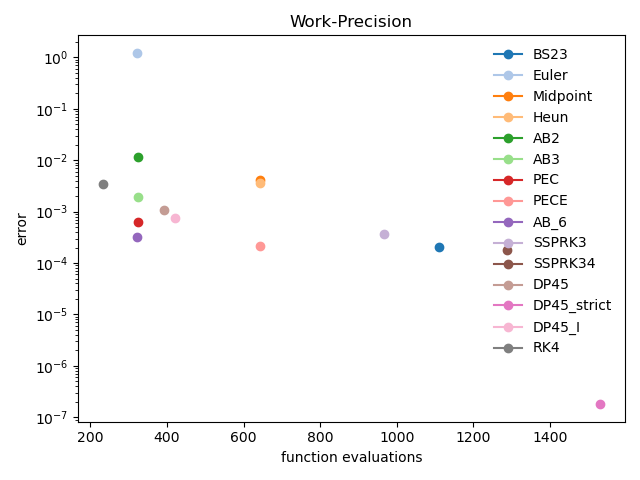
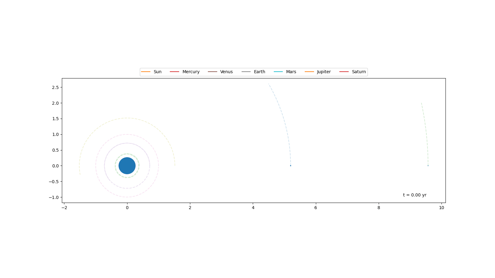
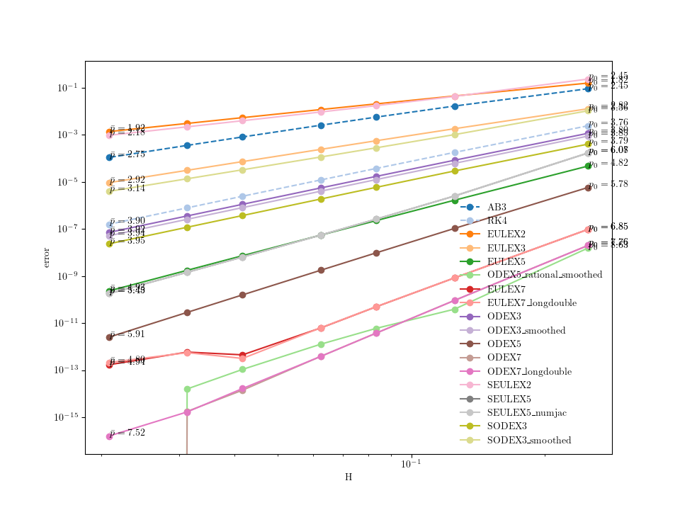

# ODE solvers
This project provides a very extensible implementation of extrapolation schemes for time integration.

Explicit and implicit methods with variants for implicit ODEs, many different step sequences, rational and polynomial extrapolation, different step controllers are all available.
Two very advanced step controllers for selecting pairs of step size and extrapolation order make for quite efficient schemes.
New schemes or variants of existing schemes can readily be created by subclassing and overriding the relevant methods.

Some examples of schemes that are available or can quickly be created are Bulirsch-Stoer, the schemes ODEX, EULEX, SODEX and SEULEX from Hairer and Wanner and METAN and DIFEX schemes from Deuflhard.

For comparison purposes, there are also python implementations of several standard ODE solvers. This includes Runge-Kutta and basic multistep methods.
Some helper functions for root finding and Jacobian computation are also available.
All methods return function, Jacobian and LU computation/evaluation frequencies so that their relative performance can be compared.

Some test problems are supplied. Additionally, there are so scripts to evaluate and compare the different methods

# Examples
## work-precision graphs

## N-body simulation

## Convergence of extrapolation schemes of increasing order

